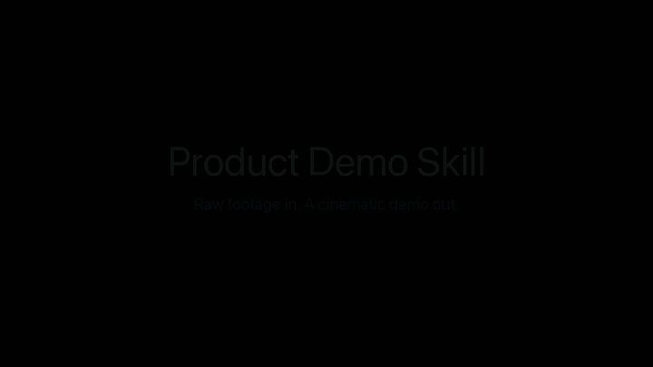

# Product Demo Skill

A Claude Code skill that turns a raw **product screen recording** + a **user-flow diagram** into a
polished, narrated **Apple-style product demo video** — fully rendered, end to end.

```
INPUT                              OUTPUT
─────                              ──────
1. Product video (screen rec)  ┐
2. User-flow diagram (img/pdf) ┘ →  demo.mp4  (re-paced video + AI narration + captions)
```

## Demo



▶ **Full video with narration & music:** [`assets/demo.mp4`](assets/demo.mp4)

*This demo was generated by the skill itself — `apple` preset, hero cards, Ken Burns
motion, kinetic captions, a spotlight callout, and a procedural music bed. The GIF
above autoplays on GitHub; the MP4 has the voiceover and audio.*

## How it works

| Phase | What happens | Tool |
|-------|--------------|------|
| 1. Analyze | Probe video, extract scene-change keyframes; Claude reads frames + flow diagram into a storyboard | `ffprobe`, `ffmpeg`, Claude vision |
| 2. Script | Claude writes Apple-style narration and a `timeline.json` (per-segment cuts, durations, captions) | Claude |
| 3. Voiceover | Render narration to audio with the best available engine | TTS (see tiers) |
| 4. Compose | Re-pace each segment (trim / hold / slow) to match its narration, add captions + optional music | `ffmpeg` |
| 5. Output | `output/demo.mp4` plus editable `timeline.json` and `narration.md`, with a QA report | — |

**Smart re-pacing:** segments are trimmed, frozen, or slowed so the footage tracks the narration —
the difference between a raw screen capture and a produced demo.

## Voiceover quality tiers

The skill auto-selects the best engine available; it always works even with no keys:

1. **ElevenLabs** — set `ELEVENLABS_API_KEY` (most natural, closest to Apple-grade)
2. **OpenAI TTS** — set `OPENAI_API_KEY`
3. **macOS `say`** — built in, zero cost, no key (default fallback)

## Style presets

| Preset | Feel | Motion | Typography | Music |
|--------|------|--------|------------|-------|
| `apple` (default) | calm, premium | subtle Ken Burns | SF Pro hero cards | soft ambient pad |
| `vox` | energetic, explanatory | punch-in spotlight | bold kinetic captions | rhythmic pulse |
| `clean` | minimal | none | small captions | none |

Set per project with `"style"` in `timeline.json`, or override at render time:

```bash
python .../compose_video.py --timeline work/timeline.json --video product.mov --out output/ --style vox
```

Music: a user-supplied `music.path` is used and ducked under narration;
otherwise a royalty-free bed is synthesized per preset.

## Requirements

- macOS (for the `say` fallback) — other engines work cross-platform
- `ffmpeg` / `ffprobe` on PATH
- Python 3.9+ (`scripts/bootstrap.sh` creates an isolated `.venv`)

## Install

```
/plugin marketplace add Ujjwalkumar-pm/claude-product-demo-skill
```

Then ask Claude: *"Make a product demo video from this recording and flow diagram."*

## Manual run

```bash
skills/creating-product-demo-video/scripts/bootstrap.sh
python skills/creating-product-demo-video/scripts/analyze_video.py  --video product.mov --diagram flow.png --out work/
# Claude fills work/timeline.json from the storyboard, then:
python skills/creating-product-demo-video/scripts/tts_render.py    --timeline work/timeline.json --out work/
python skills/creating-product-demo-video/scripts/compose_video.py --timeline work/timeline.json --video product.mov --out output/
```

See [`examples/`](examples/README.md) for a runnable sample.

## License

MIT © Ujjwal Kumar
